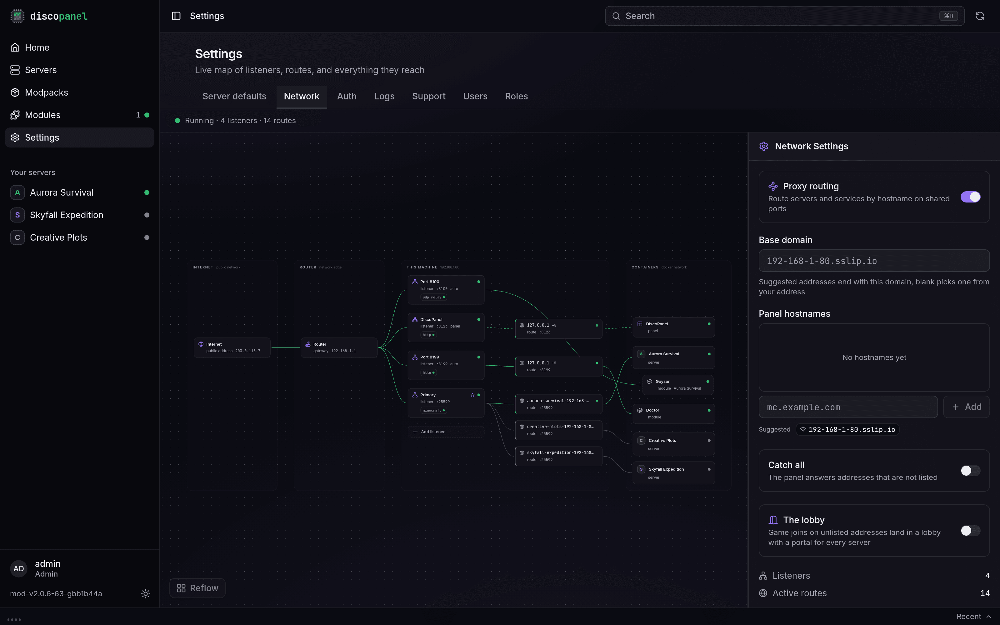
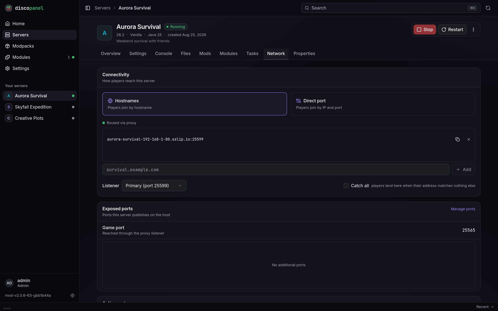

DiscoPanel has a built-in proxy for Minecraft connections. With it, all of your servers share a single port, and players connect by name:

- `survival.mc.example.com` connects to your survival server
- `creative.mc.example.com` connects to your creative server
- `modded.mc.example.com` connects to your modded server

Without the proxy, every server needs its own port, and players connect with an address like `203.0.113.5:25566`. Both ways work - the proxy is just much nicer once you run more than one server.

## Setting it up

Enable the proxy in `config.yaml` (or with the **Proxy routing** toggle on the Network page):

```yaml
proxy:
  enabled: true
  listen_port: 25565
```

Everything else lives on **Settings > Network** - a live map of your entire DiscoPanel network:



Every hostname field in DiscoPanel suggests ready-to-use names derived from one **base domain**, set on that page:

- **Leave it blank** and DiscoPanel picks a base from your machine's address that resolves with zero DNS setup. Great for LAN play or trying things out.
- **Set your own domain** like `mc.example.com` and every suggestion becomes a subdomain of it. Point a wildcard DNS record (`*.mc.example.com`) at your public IP and forward the listen port on your router - one record, one port, unlimited servers.

## Server addresses

Hostnames are added per server on its **Network** tab. A server called "Epic Survival" gets a suggestion like `epic-survival.mc.example.com` - pick it, type your own, or add several. A server can answer on as many hostnames as you like.



The same tab picks the **listener** the server answers on, and has a **Catch all** switch: players whose address matches nothing else land on that server. Without a catch-all, unmatched joins either get a polite "unknown address" screen or, if you've enabled it, [the lobby](/guides/lobby/).

## What the proxy gets you

- **One port for everything.** New servers are instantly reachable, no router changes.
- **Wake on join.** [Auto-pause](/guides/autopause/) only works behind the proxy: it's the proxy that answers pings for a sleeping server and wakes it when someone actually joins.
- **The lobby.** An optional panel-hosted [hub world](/guides/lobby/) where players pick a server by walking through a portal.
- **No exposed ports per server.** Proxied servers don't open any ports on your machine. The proxy handles all the traffic.

## Without the proxy

Servers not behind the proxy bind their own port directly (DiscoPanel suggests the next free one, counting up from `25565`). Players connect with `your-ip:port`, and each server's port has to be forwarded on your router separately. On a home network your friends need your **public** IP - search "what is my IP" - and people on the same WiFi as you use your local IP instead.

:::note
Extra ports for things like Simple Voice Chat or map mods aren't routed through the proxy. Expose those with the **Exposed ports** section in the server's Network tab.
:::

## PROXY Protocol & Real Player IPs

When traffic passes through an external edge VPS or reverse proxy (such as Pangolin VPS, HAProxy, or FRP) before reaching DiscoPanel, standard TCP connections make player connections appear as coming from the proxy's IP address (e.g. `172.19.0.2`).

To preserve real player IP addresses in your server logs and ban lists, DiscoPanel supports **PROXY Protocol (v1 & v2)** on both ingress and egress connections.

### 1. Ingress PROXY Protocol (VPS / Pangolin -> DiscoPanel)

If an external edge proxy (like Pangolin VPS) forwards player traffic to DiscoPanel on port `25565`:

1. Open **Settings > Network** in DiscoPanel.
2. Click on **Listener :25565** to open the Listener Inspector drawer.
3. Toggle **PROXY protocol (v1/v2) ingress** to **ON**.
4. (Recommended) Set **Trusted upstream proxies (CIDRs)** to your VPS IP range (e.g. `172.19.0.0/16`).

DiscoPanel will automatically unwrap the incoming PROXY header from Pangolin and extract the original player IP address.

:::note[What does Trusted Upstream Proxies mean?]
Setting **Trusted upstream proxies** specifies which IP addresses are allowed to supply a PROXY header.

If a connection arrives from an IP **within** the trusted CIDR list (e.g., your Pangolin VPS at `172.19.0.2`), DiscoPanel accepts and parses its PROXY header.

If a connection arrives from an untrusted IP address (such as a user connecting directly to DiscoPanel without going through Pangolin), any PROXY header sent by that untrusted IP is **ignored**. This prevents malicious clients from manually crafting a PROXY header to spoof their IP address.
:::

### 2. Egress PROXY Protocol (DiscoPanel -> Minecraft Server)

To forward the real player IP address to your Minecraft server container:

1. Open your server's **Network** tab in DiscoPanel.
2. Toggle **Send PROXY Protocol** to **ON**.

### 3. Server Mod & Plugin Loader Setup

For the Minecraft server engine to understand the PROXY protocol header sent by DiscoPanel and display real IPs in server logs, configure your mod/plugin loader:

#### Paper / Purpur
Paper has native support for PROXY protocol without needing any extra plugins:
1. Open `config/paper-global.yml` inside your server's Files.
2. Set `proxies.proxy-protocol: true`.
3. Restart the server.

#### Velocity Proxy
Velocity supports PROXY protocol natively:
1. Open `velocity.toml`.
2. Set `player-info-mode = "proxy-protocol"`.

#### Fabric
Fabric requires a PROXY protocol mod to parse the header:
1. Download and install **HAProxyCompat (Fabric)** or **Proxy Protocol Support** into your server's `mods/` folder.
2. Ensure **Send PROXY Protocol** is **ON** in DiscoPanel server settings.

#### NeoForge
NeoForge requires a PROXY protocol mod:
1. Download and install **HAProxyCompat (NeoForge)** into your server's `mods/` folder.
2. Ensure **Send PROXY Protocol** is **ON** in DiscoPanel server settings.

#### Forge
Forge requires a PROXY protocol mod:
1. Download and install **HAProxyCompat (Forge)** or **Proxy Protocol** mod into your server's `mods/` folder.
2. Ensure **Send PROXY Protocol** is **ON** in DiscoPanel server settings.

#### Bukkit / Spigot
For Bukkit/Spigot servers:
- Download and install the **HAProxyCompat** plugin into your server's `plugins/` folder, **or**
- Enable BungeeCord forwarding by setting `bungee: true` in `spigot.yml`.
